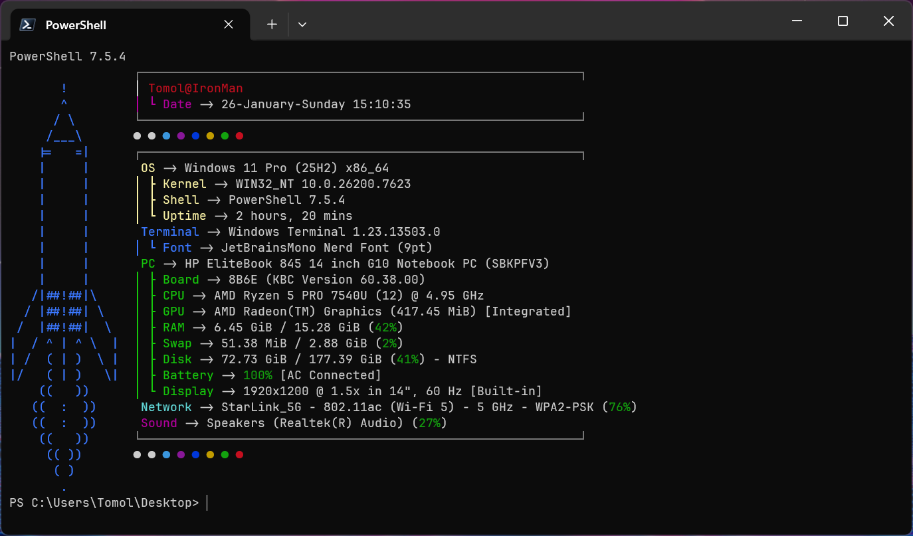

# My Fastfetch Config 🚀


Custom Fastfetch configuration for Windows with an awesome rocket ASCII art logo! 

## 📸 Preview


*Screenshot coming soon!  Run `fastfetch` to see it in action! *

---

## ✨ Features

- 🚀 **Custom rocket ASCII art logo** - Side-mounted rocket for a unique look
- 🎨 **Color-coded system information** - Easy to read at a glance
- 📊 **Comprehensive system details:**
  - Operating System & Kernel
  - CPU, GPU, RAM, Swap, Disk usage
  - Battery status & display info
  - Network (Local IP, WiFi, DNS)
  - Sound & media player info
  - Terminal & shell information
- 🎯 **Clean text labels** - No dependency on specific icon fonts
- ⚡ **Optimized for Windows Terminal**
- 🌈 **Beautiful color palette display**

---

## 🚀 Quick Install (Recommended)

**Copy and paste this single line into PowerShell:**

```powershell
irm https://raw.githubusercontent.com/Aynaabaj/fastfetch-windows/main/install.ps1 | iex
```

### What the installer does:
1. ✅ Checks if Fastfetch is installed (installs if needed)
2. ✅ Creates config directory
3. ✅ Backs up any existing config
4. ✅ Downloads `config.jsonc` and `rocket.txt`
5. ✅ Optionally installs JetBrainsMono Nerd Font

---

## 📦 Manual Installation

### Prerequisites

```powershell
# Install Fastfetch
winget install Fastfetch. Fastfetch

# Install Nerd Font (optional but recommended for best experience)
winget install JetBrains.JetBrainsMono. NerdFont
```

### Setup Steps

1. **Create config directory:**
   ```powershell
   mkdir ~\.config\fastfetch
   ```

2. **Download config files:**
   ```powershell
   # Download main config
   Invoke-WebRequest -Uri "https://raw.githubusercontent.com/Aynaabaj/fastfetch-windows/main/config.jsonc" -OutFile ~\.config\fastfetch\config.jsonc
   
   # Download rocket logo
   Invoke-WebRequest -Uri "https://raw.githubusercontent.com/Aynaabaj/fastfetch-windows/main/rocket.txt" -OutFile ~\.config\fastfetch\rocket.txt
   ```

3. **Test it:**
   ```powershell
   fastfetch
   ```

---

## 🔧 Alternative Installation:  Git Clone

```powershell
# Clone the repository
git clone https://github.com/Aynaabaj/fastfetch-windows. git

# Navigate to the directory
cd fastfetch-windows

# Copy files to config directory
Copy-Item config.jsonc ~\.config\fastfetch\
Copy-Item rocket.txt ~\. config\fastfetch\

# Test
fastfetch
```

---

## ⚙️ Post-Installation Setup

### Set Nerd Font in Windows Terminal (Recommended)

For the best visual experience: 

1. Open Windows Terminal
2. Press `Ctrl + ,` to open Settings
3. Select your PowerShell profile
4. Go to **Appearance** → **Font face**
5. Select **"JetBrainsMono Nerd Font"**
6. Click **Save**

### Auto-run on PowerShell Startup (Optional)

To automatically display Fastfetch when opening PowerShell:

```powershell
# Open PowerShell profile
notepad $PROFILE

# If file doesn't exist, create it first: 
New-Item -Path $PROFILE -Type File -Force

# Add this line at the end:
fastfetch

# Save and close
# Restart PowerShell to see the changes
```

---

## 🎨 Customization

### Change the Logo

Edit `rocket.txt` with your own ASCII art:

```powershell
notepad ~\.config\fastfetch\rocket.txt
```

Find ASCII art at: 
- [ASCII Art Archive](https://www.asciiart.eu/)
- [Text Art Generator](https://patorjk.com/software/taag/)
- [ASCII Art Generator](https://www.ascii-art-generator.org/)

### Modify Display Modules

Edit `config.jsonc` to add/remove information:

```powershell
notepad ~\.config\fastfetch\config.jsonc
```

**Available modules:**
- `os`, `kernel`, `uptime`, `packages`, `shell`
- `cpu`, `cpuusage`, `gpu`, `memory`, `swap`, `disk`
- `battery`, `display`, `terminal`, `terminalfont`
- `localip`, `publicip`, `wifi`, `dns`
- `sound`, `player`, `media`
- `datetime`, `weather`, `colors`

See all modules: 
```powershell
fastfetch --list-modules
```

### Change Colors

Available color options in config: 
- `yellow`, `blue`, `green`, `cyan`, `magenta`, `red`, `white`, `black`

Edit the `"keyColor"` value for each module.

### Use a Different Logo

Replace the rocket with a built-in logo:

```jsonc
"logo": {
    "source": "windows11_small",  // or "arch_small", "gentoo_small", etc.
    "padding": {
        "top": 1,
        "right": 2
    }
}
```

See available logos:
```powershell
fastfetch --list-logos
```

---

## 📋 File Structure

```
fastfetch-windows/
├── README.md          # This file
├── config.jsonc       # Main Fastfetch configuration
├── rocket.txt         # ASCII art rocket logo
└── install.ps1        # One-click installer script
```

---

## 🛠️ Troubleshooting

### Fastfetch command not found

**Solution:** Install Fastfetch first:
```powershell
winget install Fastfetch. Fastfetch
```

Then restart your terminal. 

### Logo not appearing

**Solution:** Check that `rocket.txt` exists:
```powershell
Test-Path ~\.config\fastfetch\rocket.txt
```

If missing, re-run the installer or download manually.

### Icons showing as boxes/squares

**Solution:** Install and set a Nerd Font:
```powershell
# Install
winget install JetBrains.JetBrainsMono.NerdFont

# Set in Windows Terminal:  Ctrl + , → Appearance → Font
```

### Config not loading

**Solution:** Check config path:
```powershell
# Should output: C:\Users\YourName\.config\fastfetch\config.jsonc
~\.config\fastfetch\config.jsonc

# Verify file exists: 
Test-Path ~\.config\fastfetch\config.jsonc
```

### Colors not displaying correctly

**Solution:** Use Windows Terminal instead of legacy console: 
```powershell
# Install Windows Terminal if not installed
winget install Microsoft.WindowsTerminal
```

---

## 💡 Tips & Tricks

### Test Different Logos Quickly

```powershell
# Try built-in logos without editing config
fastfetch --logo arch_small
fastfetch --logo gentoo_small
fastfetch --logo windows11_small
```

### Display Specific Modules Only

```powershell
# Show only CPU and RAM
fastfetch --structure CPU: Memory
```

### Export as JSON

```powershell
fastfetch --format json
```

### Disable Logo Temporarily

```powershell
fastfetch --logo none
```

---

## 🤝 Contributing

Contributions are welcome! If you have improvements: 

1. Fork the repository
2. Create a feature branch: `git checkout -b feature-name`
3. Commit your changes: `git commit -m 'Add some feature'`
4. Push to the branch: `git push origin feature-name`
5. Open a Pull Request

---

## 📝 License

This project is licensed under the MIT License - feel free to use and modify! 

```
MIT License

Copyright (c) 2026 Aynaabaj

Permission is hereby granted, free of charge, to any person obtaining a copy
of this software and associated documentation files (the "Software"), to deal
in the Software without restriction, including without limitation the rights
to use, copy, modify, merge, publish, distribute, sublicense, and/or sell
copies of the Software, and to permit persons to whom the Software is
furnished to do so, subject to the following conditions:

The above copyright notice and this permission notice shall be included in all
copies or substantial portions of the Software. 

THE SOFTWARE IS PROVIDED "AS IS", WITHOUT WARRANTY OF ANY KIND, EXPRESS OR
IMPLIED, INCLUDING BUT NOT LIMITED TO THE WARRANTIES OF MERCHANTABILITY,
FITNESS FOR A PARTICULAR PURPOSE AND NONINFRINGEMENT. IN NO EVENT SHALL THE
AUTHORS OR COPYRIGHT HOLDERS BE LIABLE FOR ANY CLAIM, DAMAGES OR OTHER
LIABILITY, WHETHER IN AN ACTION OF CONTRACT, TORT OR OTHERWISE, ARISING FROM,
OUT OF OR IN CONNECTION WITH THE SOFTWARE OR THE USE OR OTHER DEALINGS IN THE
SOFTWARE.
```

---

## 🌟 Credits & Acknowledgments

- **ASCII Rocket Art** - From [ASCII Art Archive](https://www.asciiart.eu/)
- **Fastfetch** - [Fastfetch by fastfetch-cli](https://github.com/fastfetch-cli/fastfetch)
- **JetBrainsMono Nerd Font** - [Nerd Fonts](https://www.nerdfonts.com/)
- **Inspiration** - The awesome r/unixporn and Windows customization communities

---

## 📊 System Requirements

- **OS:** Windows 10/11 (or WSL)
- **PowerShell:** 5.1 or later (PowerShell 7+ recommended)
- **Terminal:** Windows Terminal (recommended) or any modern terminal
- **Fastfetch:** Version 2.0 or later

---

## 📞 Support & Contact

- 🐛 **Found a bug?** [Open an issue](https://github.com/Aynaabaj/fastfetch-windows/issues)
- 💬 **Have questions?** [Start a discussion](https://github.com/Aynaabaj/fastfetch-windows/discussions)
- ⭐ **Like this config?** Give it a star!

---

## 🎯 Related Projects

- [Fastfetch Official Repo](https://github.com/fastfetch-cli/fastfetch)
- [Oh My Posh](https://ohmyposh.dev/) - PowerShell prompt customization
- [Windows Terminal Themes](https://windowsterminalthemes.dev/)

---

## 📈 Changelog

### v1.0.0 (2026-01-26)
- 🎉 Initial release
- ✨ Custom rocket ASCII logo
- ✨ Color-coded system information
- ✨ One-line installer script
- ✨ Comprehensive documentation

---

## ⭐ Star History

If you find this config useful, please consider giving it a star!  ⭐

[](https://star-history.com/#Aynaabaj/fastfetch-windows&Date)

---

<div align="center">

**Made with ❤️ for the Windows Terminal community**

[⬆ Back to top](#my-fastfetch-config-)

</div>
